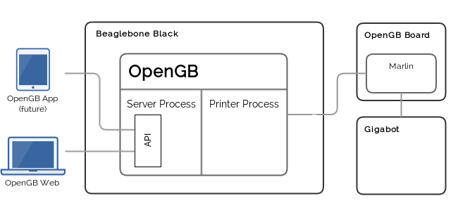

.. _architecture:

Architecture
------------

OpenGB employs a multi-process architecture to ensure reliable, uninterrupted printing.

Server Process
^^^^^^^^^^^^^^

The server process:

* Exposes printer functions to clients via JSON-RPC 2.0 `methods`.
* Broadcasts printer events to clients via JSON-RPC 2.0 `events`.
* Serves the OpenGB web interface.

It is based on the `Tornado`_ asynchronous web framework.

Printer Process
^^^^^^^^^^^^^^^

The printer process:

* Translates messages sent from the Server process and forwards them to the printer.
* Translates messages sent from the Printer into events and forwards them to the Server process.
* Performs routine requests (for printer metrics etc).

The printer process is extensible, allowing support for additional firmware interfaces to be added in the future.

.. _Tornado: http://www.tornadoweb.org/en/stable/
