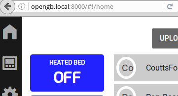

.. _configuration:

Configuration
-------------

.. note::

    OpenGB is tested with and designed to run on the `Raspberry Pi Model 3B`_
    with a `Raspberry Pi Touch Display`_, the `Raspbian`_ operating system
    and the `Iceweasel`_ web browser.

    The instructions below are specific to this platform but in most
    cases should be transferrable to any host running a Linux-based operating
    system and Python 3.4+.

Autostart
^^^^^^^^^

OpenGB Web Interface
====================

To start Iceweasel running the OpenGB web interface fullscreen automatically on boot:

::

    sudo apt-get install iceweasel xdotool

    cat << EOF >> ~/.config/lxsession/LXDE-pi/autostart
    @iceweasel http://opengb.local:8000
    @sleep 10
    @xdotool key --clearmodifiers F11 
    EOF

Multicast DNS
^^^^^^^^^^^^^

`Multicast DNS`_ (also known as "mDNS" or "ZeroConf") allows a host to be accessed by name rather than IP addresss. Raspbian provides mDNS services via the `avahi-daemon` which is enabled by default.

Change hostname to OpenGB
=========================

To change the Raspbian hostname from the default `raspberrypi` to `opengb`:

::

    sudo sed -i -e 's/raspberrypi/opengb/g' /etc/hosts
    sudo sed -i -e 's/raspberrypi/opengb/g' /etc/hostname
    sudo reboot

Upon reboot you should be able to navigate to opengb via http://opengb.local:8000.

Multiple OpenGB Instances
=========================

If you are running multiple instances of OpenGB on the same network simply choose a different hostname for each instance. E.g.:

OpenGB instance #1:

::

    sudo sed -i -e 's/opengb/opengb1/g' /etc/hosts
    sudo sed -i -e 's/opengb/opengb1/g' /etc/hostname
    sudo reboot

OpenGB instance #2:

::

    sudo sed -i -e 's/opengb/opengb2/g' /etc/hosts
    sudo sed -i -e 's/opengb/opengb2/g' /etc/hostname
    sudo reboot

OpenGB instance #3:

::

    sudo sed -i -e 's/opengb/opengb3/g' /etc/hosts
    sudo sed -i -e 's/opengb/opengb3/g' /etc/hostname
    sudo reboot

Touchscreen
^^^^^^^^^^^

Screensaver
===========

To disable screen blanking:

::

    cat << EOF >> ~/.config/lxsession/LXDE-pi/autostart
    @xset s noblank
    @xset s off
    @xset -dpms
    EOF

Pointer
=======

To disable the mouse pointer:

::

    sudo apt-get install unclutter
    echo "unclutter -idle 5" >> ~/.config/lxsession/LXDE-pi/autostart
 

.. _`Raspberry Pi Model 3B`: https://www.raspberrypi.org/products/raspberry-pi-3-model-b/
.. _`Raspberry Pi Touch Display`: https://www.raspberrypi.org/products/raspberry-pi-touch-display/
.. _`Raspbian`: https://www.raspbian.org/
.. _`Multicast DNS`: https://en.wikipedia.org/wiki/Multicast_DNS
.. _`Iceweasel`: https://wiki.debian.org/Iceweasel
