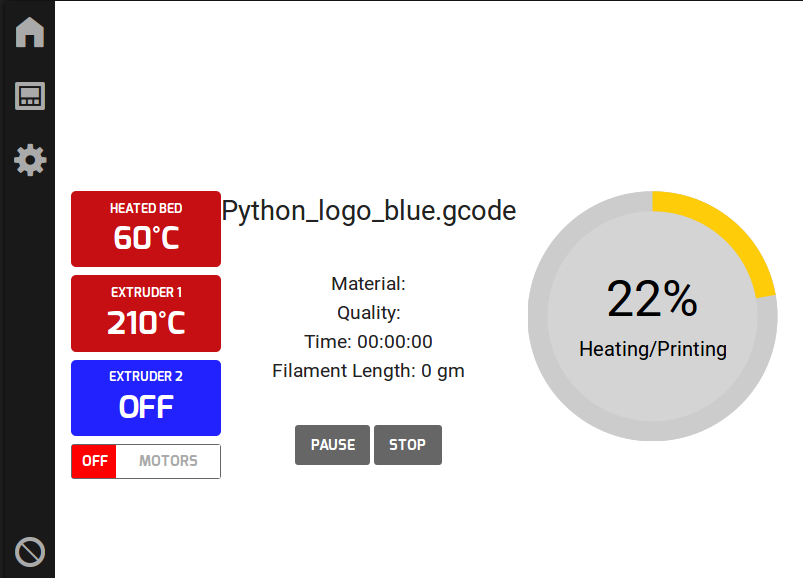

OpenGB
======

**This project is discontinued.**

OpenGB was partly sponsored by re:3D as part of the Open Gigabot project.

Ultimately Octoprint emerged as a better-resourced and more mature alternative and so work on OpenGB was discontinued in 2017.

You can learn more about OpenGB by watching @amorphic's PyCon AU `talk`_ **Controlling a 3D printer with Python**.

OpenGB is a 3D printer control interface.

OpenGB was originally created for the `Open Gigabot`_ open-source 3D printer designed and built by `re:3D`_:

* **Interface Design:** Katy Jeremko
* **Backend Development:** James Stewart
* **Frontend Development:** Levi Lalla

OpenGB is also be compatible with other printers running `Marlin`_ firmware and a wider range of open-source firmware will be supported in the future.

.. toctree::
    :caption: Usage
    :maxdepth: 2

    installation
    configuration
    
.. toctree::
    :caption: Development 
    :maxdepth: 2

    architecture
    api
    contributing

Indices and tables
==================

* :ref:`genindex`
* :ref:`modindex`
* :ref:`search`

.. _Open Gigabot: https://www.kickstarter.com/projects/re3d/open-gigabot-an-open-source-gigabot-3d-printer-exp
.. _`re:3D`: https://re3d.org/
.. _Marlin: http://www.marlinfirmware.org/index.php/Main_Page
.. _talk: https://www.youtube.com/watch?v=qgvnPB_77z8
